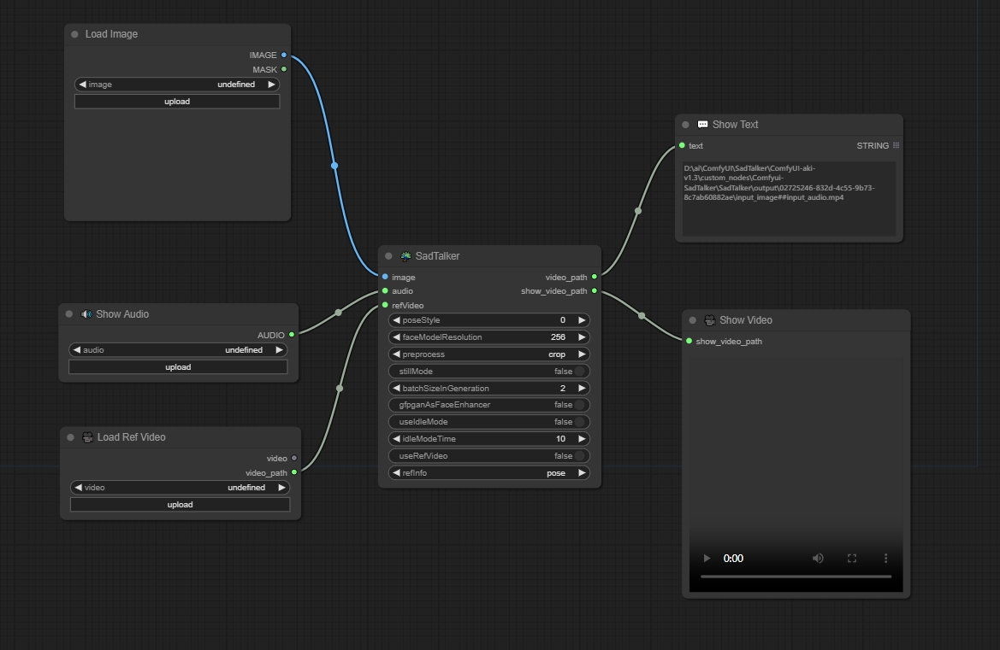

# Comfyui-SadTalker

### 版权声明（Copyright）

- [SadTalker](https://github.com/OpenTalker/SadTalker)

### 注意（Notice）

- 首次开发插件，节点可能存在问题，如果遇到了困难，请提交 Issues.（This is the first time to develop a plugin. There may be problems with the node. If you run into difficulties, please submit Issues.）

### 例子（Examples）

### 安装（Install）

1. ...custom_nodes\Comfyui-SadTalker\SadTalker\checkpoints\
   - SadTalker_V0.0.2_256.safetensors（691MB）
   - SadTalker_V0.0.2_512.safetensors（691MB）
2. ...custom_nodes\Comfyui-SadTalker\SadTalker\gfpgan\weights\  and  ...(comfyui root)\gfpgan\weights\
   - alignment_WFLW_4HG.pth（184MB）
   - detection_Resnet50_Final.pth（104MB）
   - GFPGANv1.4.pth（332MB）
   - parsing_parsenet.pth（81.3MB）

